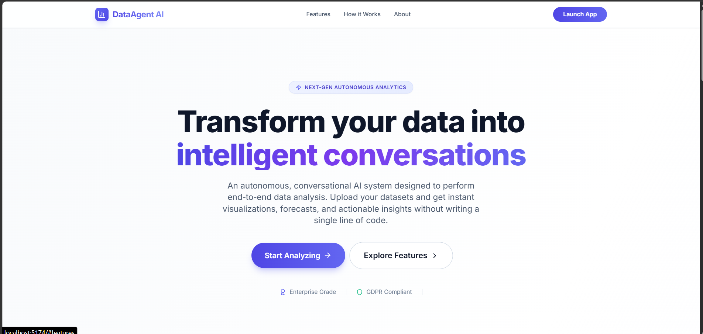
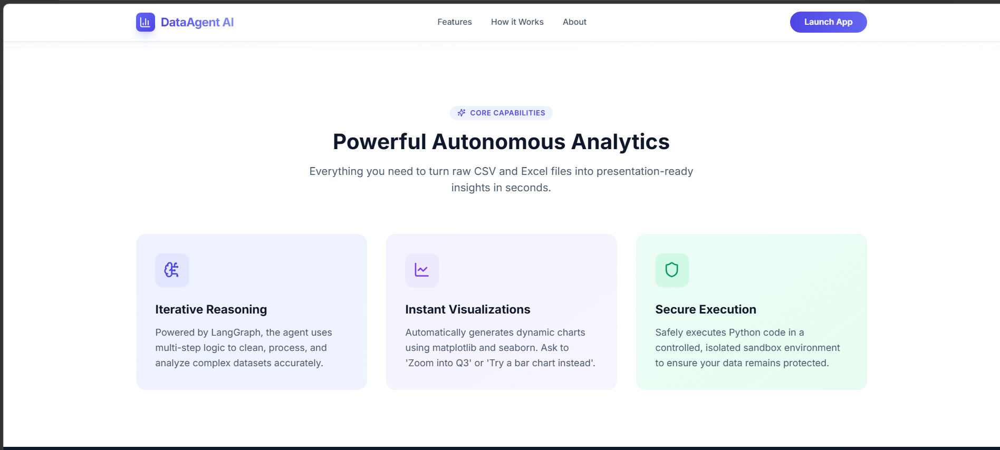
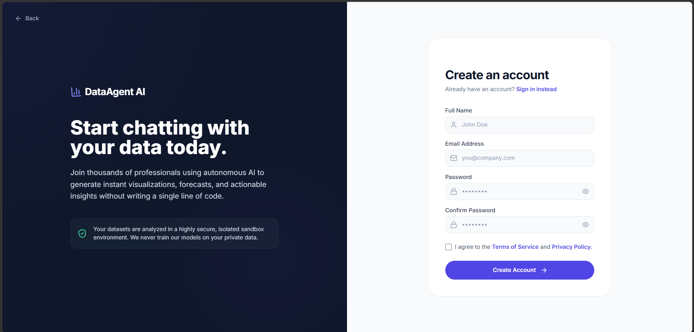
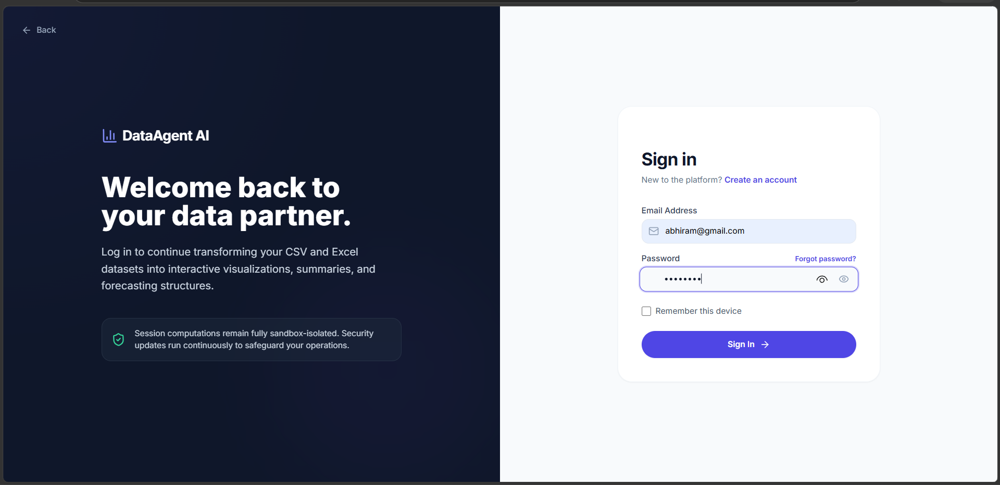
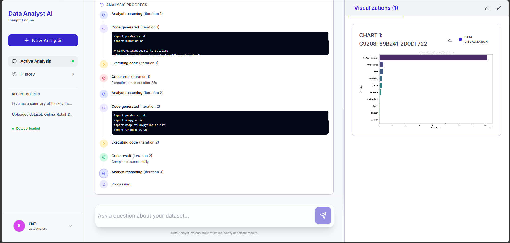
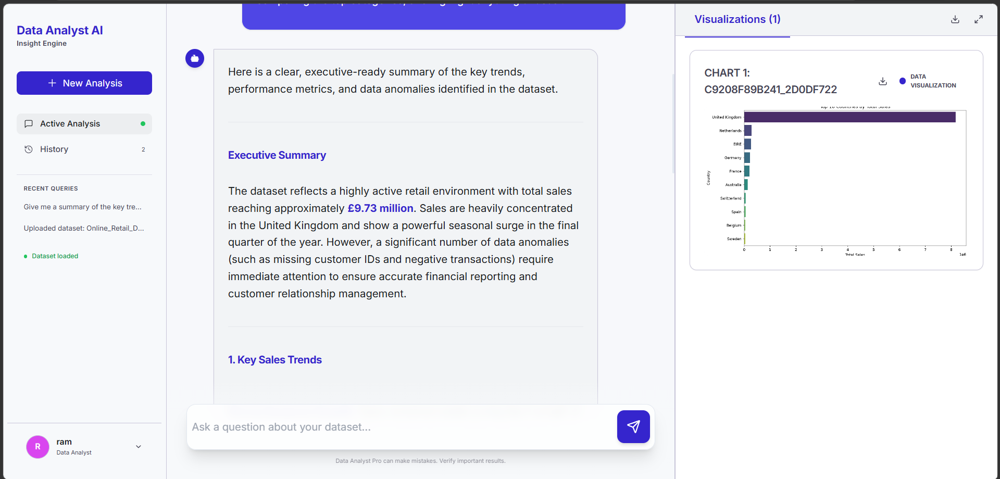
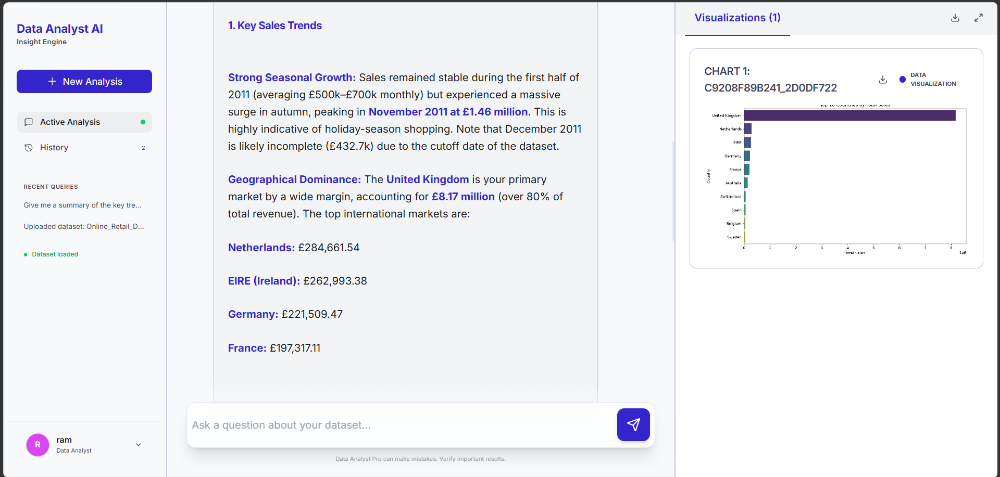

# Agent Data Analyst

A conversational AI data analyst. Upload a CSV/Excel dataset and chat with an
agent that writes and executes real pandas/Python code against your data,
iterates on its own results, and returns a plain-English narrative with
auto-generated charts.

The raw dataset is **never sent to any LLM** — only a compact statistical
profile is. The AI only ever writes code; that code runs locally, in an
isolated subprocess, against the real data.

## Architecture

The app is three independent services:

| Service | Path | Stack | Port | Responsibility |
|---|---|---|---|---|
| Client | `client/` | React 19 + Vite + Tailwind | 5173 (dev) | UI: auth pages + chat/analysis workspace |
| Auth server | `server/` | Node/Express + MongoDB | 5000 | Signup, login, JWT, password reset (OTP email) |
| Analyst backend | `backend/` | FastAPI + LangGraph + Redis + Gemini | 8000 | Upload → clean → agentic analysis → charts |

In dev, Vite proxies the browser's requests: `/api/auth/*` → the Node server
(5000), everything else under `/api/*` → the FastAPI backend (8000). See
`client/vite.config.js`.

### How a request flows

1. **Auth** — client → Node server → MongoDB. Returns a JWT stored in
   `localStorage`.
2. **Upload** — client → FastAPI. The file is profiled with pandas (no LLM),
   the profile is sent to Gemini for a cleaning plan, the plan is executed
   with pandas, and the cleaned data is cached (Redis) as a Parquet file.
3. **Chat** — client opens a Server-Sent Events stream to
   `/api/chat/stream`. A LangGraph loop (`main_analyst ⇄ tool_executor`)
   lets the agent decide, turn by turn, whether to write more code or give
   a final answer; generated code runs in an isolated subprocess against the
   real cleaned dataframe. Once done, a final Gemini call ("insight
   synthesizer") turns the trace into a polished narrative. Every step and
   chart streams to the UI live.

## Prerequisites

- **Node.js** ≥ 18 and npm — for `client/` and `server/`
- **[uv](https://docs.astral.sh/uv/)** — for `backend/` (manages its own
  Python ≥ 3.11 install)
  ```bash
  curl -LsSf https://astral.sh/uv/install.sh | sh
  ```
- **MongoDB** database (e.g. a free MongoDB Atlas cluster)
- **Redis** instance (local, or a free Redis Cloud instance)
- A **Gemini API key** ([Google AI Studio](https://aistudio.google.com/apikey))
- A **Gmail account with an App Password** (for OTP password-reset emails) —
  requires 2-Step Verification enabled on the Gmail account, then generate
  an App Password under Google Account → Security.

## Setup

Clone the repo, then configure each service's environment.

```bash
git clone <your-repo-url>
cd Agent-Data-Analyst
```

### 1. Auth server (`server/`)

```bash
cd server
cp .env.example .env
```
Fill in `server/.env`: `PORT`, `JWT_SECRET` (generate a random string, see
comment in the example file), `MONGODB_URI`, `EMAIL_USER`,
`EMAIL_APP_PASSWORD`.

```bash
npm install
```

### 2. Analyst backend (`backend/`)

```bash
cd ../backend
cp .env.example .env
```
Fill in `backend/.env`: `REDIS_URL`, `GEMINI_API_KEY` (and optionally
`GEMINI_MODEL` / `GEMINI_ANALYST_MODEL` if you want to point at a different
Gemini model).

```bash
uv sync
```

### 3. Client (`client/`)

```bash
cd ../client
npm install
```
No `.env` needed — API calls are routed through the Vite dev proxy.

## Running the app

Open **three terminals**, one per service, and start them in this order.

**1. Auth server** (port 5000)
```bash
cd server
npm start
```

**2. Analyst backend** (port 8000)
```bash
cd backend
uv run uvicorn app.main:app --reload --port 8000
```
Check `http://localhost:8000/api/health` — it should report
`{"status":"ok","redis_connected":true}`. Interactive API docs are at
`http://localhost:8000/docs`.

**3. Client** (port 5173)
```bash
cd client
npm run dev
```
Open the URL Vite prints (usually `http://localhost:5173`).

## Project structure

```
Agent-Data-Analyst/
├── client/                 # React + Vite frontend
│   ├── src/
│   │   ├── Pages/          # Home, Signup, Login, ChatbotPage, ...
│   │   ├── components/     # Sidebar, InputBar, ProgressLog, ...
│   │   └── context/        # AuthContext (JWT/session state)
│   └── vite.config.js      # dev proxy → server:5000 / backend:8000
│
├── server/                 # Node/Express auth service
│   ├── Routes/auth.js      # signup/login/profile/OTP endpoints
│   ├── middlewares/        # JWT auth middleware
│   └── models/user.js      # Mongoose user schema
│
└── backend/                 # FastAPI analyst service
    ├── app/main.py          # API routes (upload/chat/chat-stream/charts)
    ├── app/graph/           # LangGraph graphs + node implementations
    ├── app/sandbox/         # isolated subprocess code executor
    ├── app/llm/             # Gemini API clients
    ├── app/services/        # profiling, cleaning, file I/O
    └── app/redis_client.py  # session state + chat history
```

## Security notes

- **Never commit `.env` files.** Only the `.env.example` files (no real
  secrets) are tracked in git.
- If you ever accidentally commit real credentials, rotate them
  immediately (Redis, MongoDB, Gemini, Gmail App Password, `JWT_SECRET`) —
  removing the file in a later commit does not remove it from git history.
- The code sandbox (`backend/app/sandbox/`) isolates analyst-generated code
  in a separate OS subprocess with a timeout, but is **not a hardened
  security boundary** — it's suitable for local/personal use, not for
  running untrusted code from unknown users in production. For that, use a
  real sandbox (gVisor, nsjail, or a locked-down container with no network
  egress).
- CORS on the FastAPI backend currently allows all origins
  (`allow_origins=["*"]`) — tighten this before deploying publicly.

## Screenshots











